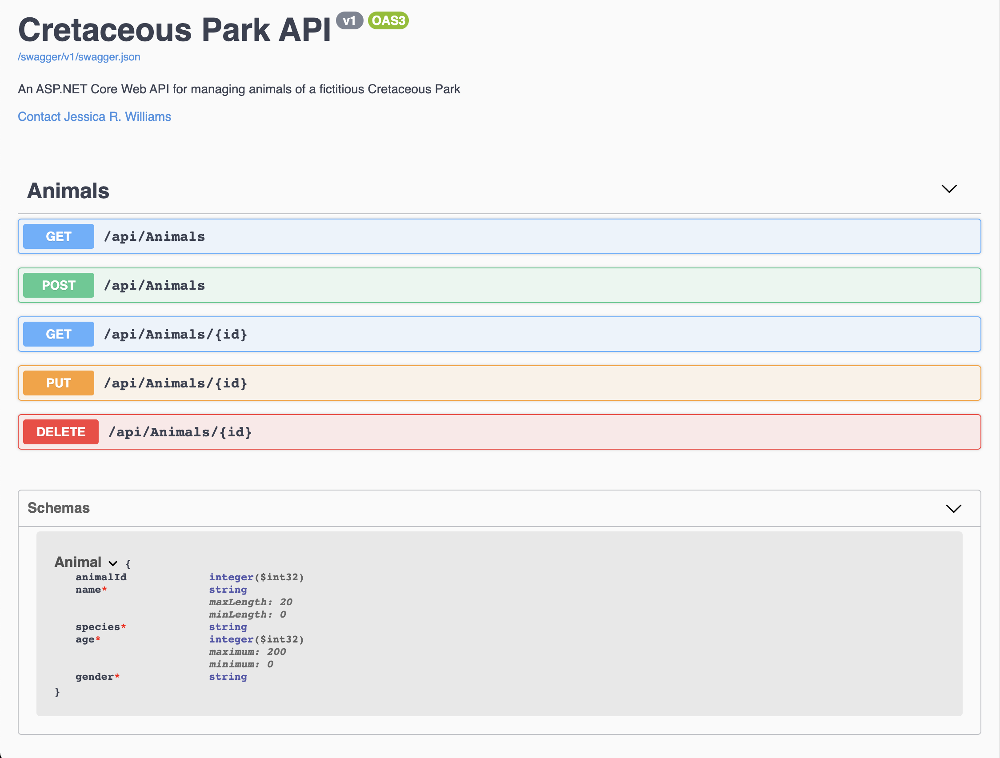

# Cretaceous Park API

#### _A queryable C#/.NET API using RESTful principles that shares data about a fictitious wildlife park consisting of creatures from the cretaceous era._

#### By **Jessica R. Williams**

## Table of Contents

1. [Technologies Used](#technologies)
2. [Description](#description)
3. [Setup/Installation Requirements and Instructions](#setup)
4. [Known Bugs](#bugs)
5. [License](#license)
6. [Contact Information](#contact)

## Technologies Used <a id="technologies"></a>

* _C#_
* _.NET 5.0.100_
* _ASP.NET Core MVC_
* _dotnet.ef 5.0.2_
* _Microsoft.AspNetCore.Identity.EntityFrameworkCore 5.0.0_
* _Microsoft.EntityFrameworkCore 5.0.0_
* _Microsoft.EntityFrameworkCore.Design 5.0.0_
* _Microsoft.NET.Sdk.Web_
* _Pomelo.EntityFrameworkCore.MySql 5.0.0-alpha.2_
* _Swashbuckle.AspNetCore 5.6.3_

## Description <a id="description"></a>

This C#/.NET API allows other developers to interact with data for a fictitious wildlife park consisting of creatures from the cretaceous era. Data is stored in a SQL database.

## Setup/Installation Requirements and Instructions <a id="setup"></a>

### Install C#, .NET, MySQL Community Server, MySQL Workbench and dotnet-ef
* Open the terminal on your local flavor
* If [C#](https://docs.microsoft.com/en-us/dotnet/csharp/) and [.NET](https://docs.microsoft.com/en-us/dotnet/) are not installed on your local device, follow the instructions [here](https://www.learnhowtoprogram.com/c-and-net-part-time-c-and-react-track/getting-started-with-c/installing-c-and-net)
* If [MySQL Community Server](https://dev.mysql.com/downloads/mysql/) and [MySQL Workbench](https://www.mysql.com/products/workbench/) are not installed on your local device, follow the instructions [here](https://www.learnhowtoprogram.com/c-and-net-part-time-c-and-react-track/getting-started-with-c/installing-and-configuring-mysql)
* If [dotnet-ef](https://docs.microsoft.com/en-us/ef/core/cli/dotnet) is not installed on your local device, install it with the terminal command `dotnet tool install --global dotnet-ef --version 5.0.2`

### Clone the project
* Navigate to the directory inside of which you wish to house this project
* Clone this project with the command `$ git clone https://github.com/jessicarubinwilliams/CretaceousPark.Solution`

### Scaffold and connect the database
* Launch the MySQL server with the command `mysql -uroot -p[YOUR-PASSWORD-HERE]`
* In your terminal, navigate to the production project directory with the command `$ cd CretaceousPark.Solution/CretaceousPark`
* In your terminal, create a file within the project in which to store your connection string for connecting the project to the database with the command `touch appsettings.json`
* In your text editor add the following code to the newly created appsettings.json file. *Note that uid and pwd may vary depending on your local MySql configurations.
```
{
  "ConnectionStrings": {
    "DefaultConnection": "Server=localhost;Port=3306;database=cretaceous_park;uid=root;pwd=[YOUR-PASSWORD-HERE];"
  }
}
```
* Recreate project environment and install required dependencies with terminal command `$ dotnet restore`
* Scaffold the database with the command `$ dotnet ef database update`

### Run the project
* Run the program in the console with the command `$ dotnet run`
* Open the project by navigating your browser to http://localhost:5000/api/Animals or http://localhost:5001/api/Animals


### Explore the API Endpoints and Schema with Swagger
* Once you've run the program in the console (see above), explore and test the API endpoints and schema with Swagger by navigating to http://localhost:5000/swagger/index.html



## Known Bugs <a id="bugs"></a>
* No known bugs

## License <a id="license"></a>
*[MIT](https://choosealicense.com/licenses/mit/)*

Copyright (c) **2021 Jessica R. Williams**

## Contact Information <a id="contact"></a>
**[Jessica R. Williams](mailto:jessicarubinwilliams@gmail.com)**